# Redshift-ETL-Project 🚀🔧

[](https://www.python.org/) [](https://spark.apache.org/) [](https://aws.amazon.com/redshift/) [](https://hadoop.apache.org/) [](https://sqoop.apache.org/) [](LICENSE)

**Data Engineering ETL Assignment** is a comprehensive project demonstrating data ingestion, ETL processes, and analytical querying using AWS Redshift, Apache Spark, and Sqoop. The project covers the complete data pipeline—from importing data from an RDS source to HDFS using Sqoop, processing data with Spark, to executing analytical queries on an AWS Redshift cluster.

---

## 📖 Overview

This project is designed to showcase a real-world ETL workflow for a data engineering assignment:
- **Data Ingestion:** Import data from an RDS (MySQL) database to HDFS using Sqoop.
- **ETL Processing:** Use Apache Spark for data transformation and loading.
- **Analytical Queries:** Execute complex analytical queries on an AWS Redshift cluster to derive insights.

The provided documents include detailed Redshift queries, cluster setup screenshots, Spark ETL code, and Sqoop data ingestion commands.

---

## 🛠️ Technologies & Tools

<div align="center">
  <a href="https://www.python.org/">
    
  </a>
  <a href="https://spark.apache.org/">
    
  </a>
  <a href="https://aws.amazon.com/redshift/">
    
  </a>
  <a href="https://hadoop.apache.org/">
    
  </a>
  <a href="https://sqoop.apache.org/">
    
  </a>
</div>

---

## 🔄 Data Flow Diagram

```mermaid
flowchart TD
    A[🗄️ RDS - MySQL] --> B[📥 Sqoop Import]
    B --> C[📁 HDFS]
    C --> D[🔄 Spark ETL Processing]
    D --> E[📤 Data Load]
    E --> F[AWS Redshift]
    F --> G[🔍 Analytical Queries]
```




---

## 🗂️ Project Structure

```plaintext
DataEngineeringETL/
├── RedshiftQueries.pdf       # PDF containing analytical queries for the Redshift cluster
├── RedshiftSetup.pdf         # PDF with screenshots and details on setting up the Redshift cluster
├── SparkETLCode.ipynb        # Jupyter Notebook with Spark ETL code and transformation logic
├── SqoopDataIngestion.pdf     # PDF outlining the Sqoop import commands and HDFS data inspection
└── README.md                 # Project documentation (this file)
```

---

## 💻 Setup & Deployment

### Prerequisites

- **AWS Account:** For setting up Redshift and S3.
- **RDS MySQL Instance:** Source of data.
- **Hadoop Cluster:** For HDFS (local or cloud-based).
- **Apache Sqoop & Spark:** Installed on your data processing cluster.

### Setup Steps

1. **Data Ingestion with Sqoop:**
   - Use the Sqoop commands detailed in `SqoopDataIngestion.pdf` to import tables from RDS into HDFS.
   - Verify data import using Hadoop FS commands.

2. **ETL Processing with Spark:**
   - Open `SparkETLCode.ipynb` in Jupyter Notebook.
   - Follow the ETL workflow to clean, transform, and load data.

3. **Redshift Cluster Setup:**
   - Follow the guidelines in `RedshiftSetup.pdf` to create a Redshift cluster and configure databases/tables.
   - Execute the SQL queries from `RedshiftQueries.pdf` on the AWS Redshift Query Editor.

---

## 🚀 Usage

- **Run ETL:**  
  Execute the Spark ETL Notebook (`SparkETLCode.ipynb`) to process and prepare data.
  
- **Load & Query Data:**  
  Load the transformed data into Redshift and run analytical queries to generate insights.

- **Review Documentation:**  
  Refer to the PDF files for detailed instructions on Redshift setup, query execution, and Sqoop data ingestion.

---

## ⭐️ Call-to-Action

If you find this project useful, please consider:
- **Starring** the repository ⭐
- **Forking** to contribute improvements or customizations
- **Following** for updates on similar data engineering projects

Your engagement is greatly appreciated and helps boost visibility!

---

## 📜 License

This project is licensed under the [MIT License](LICENSE).

---

## 🙏 Acknowledgements

- **AWS & Azure:** For providing robust cloud infrastructure.
- **Data Engineering Community:** For continuous inspiration and support.

---

*Happy Data Engineering! 🚀🔧*
